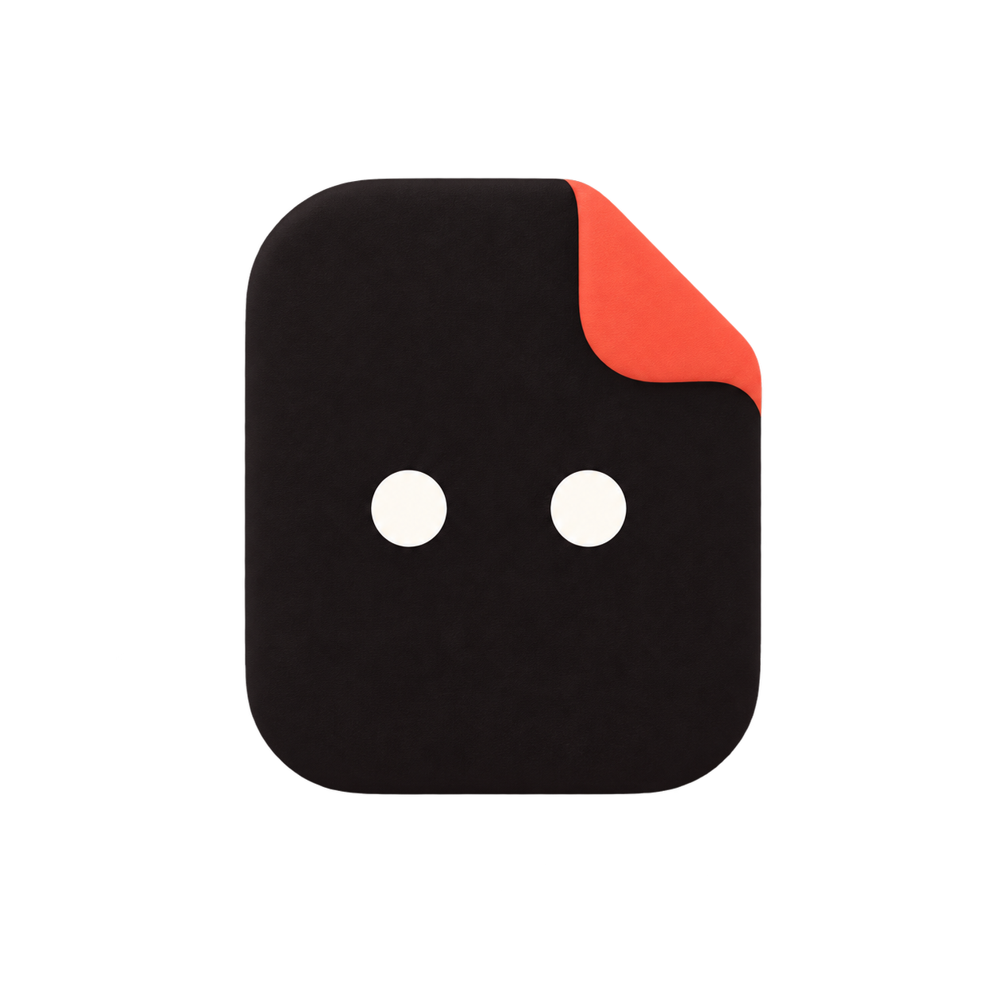
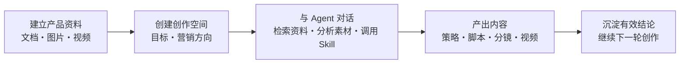

# ScriptAgent

<p align="center">
  
</p>

<p align="center"><strong>把产品资料、创意策略、脚本和视频生成连成一条工作流的广告创作 Agent。</strong></p>

ScriptAgent 面向品牌、电商和内容团队。你只需整理一次产品资料，设定本次创作目标，再像和创意搭档聊天一样提出需求；Agent 会主动查找相关资料、分析参考素材、调用合适的 Skill，并把想法推进为可执行的广告脚本、分镜提示词或 UGC 视频任务。

它重点解决三个问题：产品信息散落、每次创作都要重复交代背景，以及“策略—脚本—视频”之间需要反复手工搬运。

## 它是怎样工作的



1. **建立产品资料**：上传 Markdown、DOC、PDF、图片和视频，集中保存卖点、受众、场景与视觉素材。
2. **创建创作空间**：为一个品牌、产品或 campaign 固定创作目标，让后续内容始终围绕同一方向。
3. **与 Agent 协作**：直接描述任务。Agent 会根据上下文检索产品资料、理解图片和视频，并按需使用 Skill。
4. **生成并继续迭代**：得到策略、广告脚本、分镜和视频提示词，也可以在同一段对话中继续生成视频。

## 目前可以做什么

- **广告策略与创意方向**：结合产品卖点、目标人群和营销阶段提出内容方向。
- **素材理解**：解析上传的图片和视频，把可见内容与素材说明一并带入创作上下文。
- **脚本与分镜**：生成口播脚本、短视频结构、镜头描述和视频模型提示词，并引用选定素材。
- **UGC 视频工作流**：在对话输入区选择参考素材、比例、时长和声音参数，提交生成任务并查看结果。
- **长期创作记忆**：从产品资料、创意雷达和历史对话中提炼结论，经用户确认后继续复用。
- **可扩展 Skill**：使用系统 Skill，或用一句话创建并编辑自己的创作 Skill。

## 产品组成

- **开始**：直接向 Agent 描述任务，可选择产品资料。
- **历史**：统一检索完整对话、脚本任务与视频结果。
- **创作空间**：管理长期目标、关联产品资料、广告目标和营销阶段；设置变更只影响后续对话。
- **产品资料**：维护结构化文字与图片、视频、文档素材。
- **创意雷达**：沉淀值得继续验证的洞察和创作方向。
- **设置**：分别配置文本、多模态、图片、视频和向量模型，支持平台额度与用户自己的 API Key。
- **开发者模式**：查看模型调用、Token、耗时和 Agent 执行步骤。

当前版本支持多账号注册与登录。产品资料、创作空间、对话、任务、自定义 Skill、模型配置和调试记录均按账号隔离。正式运营后台尚未上线。

## 快速启动

### 环境要求

- Go 1.26+
- Node.js 20.19+ 或 22.12+
- npm

### 1. 获取源码

```bash
git clone https://github.com/tian1363/scriptagent.git
cd scriptagent
```

### 2. 安装依赖并构建前端

```bash
cd web/app
npm ci
npm run build
cd ../..
```

### 3. 选择运行模式并启动

首次体验推荐使用 Mock 模式，不需要 API Key：

```bash
export SCRIPT_AGENT_MODE="mock"
go run ./cmd/server
```

需要真实生成内容时，请在产品的“设置”中配置模型，或在启动服务前设置环境变量。API Key 不应提交到 GitHub：

```bash
export DASHSCOPE_API_KEY="sk-your-key"
export SCRIPT_AGENT_MODEL="qwen3.8-flash"
go run ./cmd/server
```

启动完成后，在浏览器打开 <http://127.0.0.1:8080/>。

`127.0.0.1` 是访问当前电脑上 ScriptAgent 服务的本地地址。每位使用者克隆并启动项目后，都通过自己的本地地址访问；它不是项目的公网体验地址。

未登录时可选择登录或注册。创建成功后，产品资料、创作空间、对话和设置 API 都需要登录才能访问。

### 前端开发

开发前端时，先保持 `8080` 端口的 Go 服务运行，再另开终端：

```bash
cd web/app
npm run dev
```

打开 <http://127.0.0.1:5173/>。前端开发服务仍调用 `8080` 端口的 Go API。完整地址见 [产品地址清单](docs/product-addresses.md)。

## 模型配置

推荐在产品的“设置”中分别配置文本、多模态、图片和视频模型。服务端也可以通过环境变量提供默认模型配置。

常用可选配置：

```bash
export SCRIPT_AGENT_MODE="mock"                    # 不调用真实模型
export SCRIPT_AGENT_VIDEO_FPS="2"
export SCRIPT_AGENT_MAX_DATA_URI_MB="20"
export SCRIPT_AGENT_EMBEDDING_MODEL="text-embedding-v4"
export SCRIPT_AGENT_EMBEDDING_DIMENSIONS="1024"
```

用户保存的能力配置优先于环境变量，并按账号隔离。API Key 只由后端保存，前端接口仅返回掩码。

## Langfuse

```bash
export LANGFUSE_PUBLIC_KEY="pk-lf-..."
export LANGFUSE_SECRET_KEY="sk-lf-..."
export LANGFUSE_BASE_URL="https://cloud.langfuse.com"
export LANGFUSE_ENVIRONMENT="development"
go run ./cmd/server
```

默认不上传 Prompt 和模型输出正文。只有经过数据安全确认后才开启：

```bash
export LANGFUSE_CAPTURE_CONTENT="true"
export LANGFUSE_RELEASE="local-dev"
```

## 数据与安全

- SQLite：`data/scriptagent.db`
- 上传文件：`uploads/`
- 前端构建产物：`web/app/dist/`
- 默认监听端口：`8080`
- 健康检查：`GET /api/health`

删除 `data/` 或 `uploads/` 会造成不可恢复的数据丢失。公网部署必须启用 HTTPS；面向多个组织开放前还需要补齐租户隔离、密钥加密、细粒度权限和备份策略。

## 验证

```bash
npm --prefix web/app run build
go test ./internal/jobs ./internal/chat ./internal/web ./internal/agent
```

## 文档导航

- [文档中心](docs/README.md)
- [产品地址清单](docs/product-addresses.md)
- [需求基线](docs/requirements.md)
- [技术设计](docs/technical-design.md)
- [Agent Runtime 与 Harness](docs/agent-runtime-harness.md)
- [模型能力与 BYOK](docs/model-capabilities.md)
- [Token 优化策略](docs/token-optimization.md)
- [Langfuse 可观测性](docs/langfuse-observability.md)
- [品牌规范](brand-spec.md)
- [设计验证记录](design-qa.md)

## 开源许可

ScriptAgent 基于 [Apache License 2.0](LICENSE) 开源。你可以在遵守许可证条款的前提下使用、修改和分发本项目。

## 仓库

- GitHub：<https://github.com/tian1363/scriptagent>
- 当前主分支：`main`
