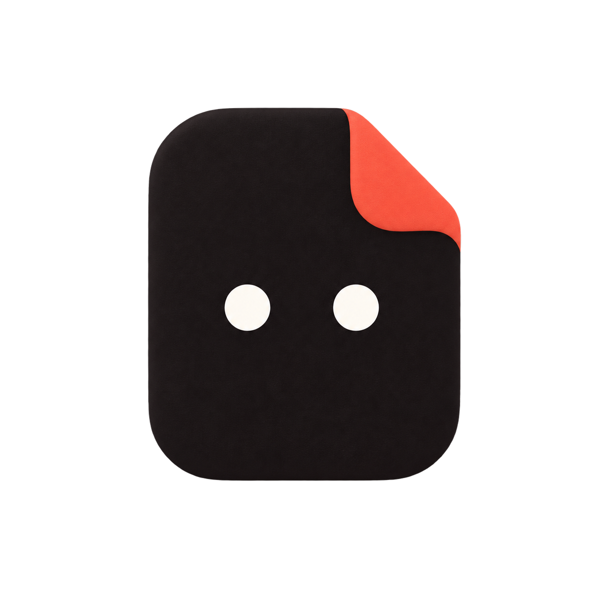

# ScriptAgent

<p align="center"></p>

<p align="center"><strong>同样的 Token，让创意更接近可用。</strong></p>

<p align="center">既然都要用 AI，就把产品事实、创作目标和素材带进每次生成。ScriptAgent 帮品牌、电商与内容团队少重复解释背景，更快把方向推进到脚本、分镜和 UGC 视频任务。</p>

<p align="center"><a href="#5-分钟本地体验">快速体验</a> · <a href="#一次创作是什么样的">创作示例</a> · <a href="docs/README.md">文档</a> · <a href="docs/invite-deployment.md">部署指南</a></p>

访问[在线官网](https://tian1363.github.io/scriptagent/)了解产品并申请 Beta 体验；官网源码与本地运行方法见 [web/website](web/website/README.md)。

> **当前状态：自托管 Beta。** 适合本地体验和小范围邀请测试。正式运营后台尚未上线；公网部署前请阅读[邀请测试部署指南](docs/invite-deployment.md)。

这里的“同样的 Token”是一种创作方法：让输入更有依据、让多轮工作复用已确认的上下文，并把生成结果接到下一步。它不代表已测得的 Token 节省比例或广告投放效果提升；实际结果取决于资料质量、所选模型与人工判断。

## 一次创作是什么样的

1. 在**产品资料**中上传卖点说明、目标人群、图片或参考视频。
2. 在**创意空间**中设定目标，例如“为新品防晒霜制作面向通勤人群的 15 秒短视频”。
3. 在对话中提出具体任务，例如：

   > 根据产品资料，先给出 3 个不同的开头，再把我选中的方向写成 15 秒口播脚本和分镜；指出每个镜头适合使用哪张产品图。

4. 继续修改脚本，或选择参考素材、比例、时长和声音参数，提交 UGC 视频生成任务并查看结果。

产品资料与创意空间会为后续对话提供上下文，减少重复解释背景。文字、图片、视频和向量能力可分别配置模型；真实生成效果取决于所配置的服务。

## 你可以用它做什么

| 需求 | ScriptAgent 中的做法 |
| --- | --- |
| 产品信息分散 | 集中管理文档、图片、视频及结构化卖点 |
| 从想法走到成稿 | 在对话中生成创意方向、口播脚本、分镜和视频提示词，并持续修改 |
| 参考素材难以复用 | 分析图片与视频，在脚本和生成任务中引用选定素材 |
| 多轮创作反复交代背景 | 用创意空间保存目标与产品关联，用创意雷达沉淀经确认的洞察 |
| 需要制作 UGC 成片 | 从对话提交视频任务，查看状态与生成结果 |
| 需要定制工作方法 | 使用内置 Skill，或创建、编辑自己的创作 Skill |

开始页、历史记录、产品资料、创意空间、创意雷达、设置和开发者模式组成当前工作台。账号之间的资料、对话、任务、模型配置与自定义 Skill 相互隔离。

## 5 分钟本地体验

需要 **Go 1.26+、Node.js 20.19+ 或 22.12+、npm**。

```bash
git clone https://github.com/tian1363/scriptagent.git
cd scriptagent
npm --prefix web/app ci
npm --prefix web/app run build
SCRIPT_AGENT_MODE=mock go run ./cmd/server
```

打开 <http://127.0.0.1:8080/>，点击“注册”创建账号后即可进入工作台。全新实例的首个账号无需邀请码；后续新用户需要部署者提供的有效邀请码。`mock` 模式无需 API Key，适合体验界面和任务流程；其中的分析与生成内容是占位结果，不能用来评价真实模型效果。

想生成真实内容，请在产品**设置**中分别配置所需模型与 API Key。保存用户 API Key 前需配置 `SCRIPT_AGENT_ENCRYPTION_KEY`；完整配置见 [.env.example](.env.example) 和[模型能力说明](docs/model-capabilities.md)。也可以在启动前设置服务端环境变量，例如：

```bash
export DASHSCOPE_API_KEY="sk-your-key"
export SCRIPT_AGENT_MODEL="qwen3.8-flash"
go run ./cmd/server
```

不要将 API Key 提交到仓库。`127.0.0.1` 是你自己电脑上的服务地址，不是公开在线体验地址。

### 前端开发

保持 Go 服务运行，另开终端执行：

```bash
npm --prefix web/app run dev
```

前端开发地址为 <http://127.0.0.1:5173/>，API 仍由 `8080` 端口提供。

## 运行与部署须知

- 数据库：`data/scriptagent.db`；上传文件：`uploads/`；健康检查：`GET /api/health`。
- 不要删除已有的 `data/` 或 `uploads/`，否则数据无法恢复。部署时请做好备份并启用 HTTPS。
- 平台托管额度在邀请测试中默认关闭。多组织开放前仍需完善租户隔离、权限和备份策略。
- 可选的 Langfuse 接入默认不上传 Prompt 与模型输出正文；配置方法见[文档](docs/langfuse-observability.md)。

## 验证与文档

```bash
npm --prefix web/app run build
go test ./internal/jobs ./internal/chat ./internal/web ./internal/agent
```

从[文档中心](docs/README.md)进入[产品需求](docs/requirements.md)、[技术设计](docs/technical-design.md)、[UGC 视频生成](docs/ugc-video-generation.md)、[模型配置](docs/model-capabilities.md)和[安全策略](SECURITY.md)。

## 开源许可

基于 [Apache License 2.0](LICENSE) 开源。
