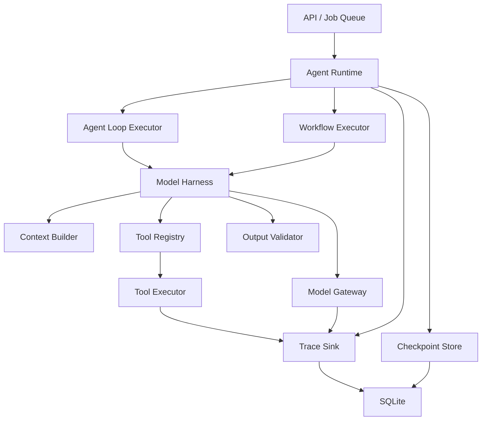

# Agent Runtime 与 Harness 设计

本文档定义 ScriptAgent 的 Agent 执行底座。目标不是把所有业务都改造成自由循环 Agent，而是为固定脚本流水线和交互式 Agent 提供一致、可恢复、可观测、可控制成本的运行环境。

## 1. 设计结论

ScriptAgent 保留两种执行模式：

| 模式 | 适用场景 | 执行方式 |
|---|---|---|
| Workflow | 视频分析、复刻脚本、裂变脚本、发布等确定性任务 | 预定义步骤、结构化输入输出、支持检查点恢复 |
| Agent Loop | 通用对话、按需检索产品资料、选择 Skill | 模型决策下一动作，Runtime 限制工具、步数和预算 |

两种模式共享以下基础能力：

- `RunContext`：一次运行的身份、范围、预算和取消信号。
- Model Gateway：统一模型请求、结构化输出、重试、token 记录和脱敏。
- Tool Registry：统一工具定义、权限和参数 Schema。
- Context Builder：按预算装配会话、项目、产品和步骤上下文。
- Trace Sink：记录 Run、Step、Model Call、Tool Call 和 Memory Event。
- Checkpoint Store：保存可恢复状态，避免进程重启后从头执行。

不采用“所有任务都由 ReAct 自由规划”的方案。视频分析到脚本生成的主流程是稳定业务流程，继续使用 Workflow 更可靠，也更容易控制成本。

## 2. Runtime 与 Harness 的边界

### 2.1 Runtime 负责执行治理

Runtime 不关心脚本内容本身，负责：

- 创建和结束 `AgentRun`。
- 生成并传递 `run_id`、`space_id`、`job_id`。
- 状态流转、并发控制、取消、超时和恢复。
- 步数、模型调用次数、输入输出 token 和耗时预算。
- 调用模型、工具、Memory 和 Checkpoint 的统一观测。
- 错误分类和降级策略。

### 2.2 Harness 负责模型协作

Harness 负责让模型以可靠协议参与任务：

- 装配 Prompt 或消息。
- 注册模型可见工具。
- 解析原生 Tool Calling 或兼容协议。
- 执行工具并返回结构化结果。
- 检测重复调用、无进展循环和协议错误。
- 校验最终输出 Schema。
- 决定重试、修复或终止。

### 2.3 业务 Agent 负责领域逻辑

业务 Agent 只描述：

- 要执行哪些 Workflow Step，或 Agent Loop 的目标。
- 每一步需要什么输入。
- 使用哪些工具和模型能力。
- 输出结构和业务校验规则。

业务 Agent 不直接管理数据库运行状态、token 统计或通用重试。

## 3. 目标架构



建议的包边界：

```text
internal/runtime/        运行生命周期、预算、取消、恢复
internal/harness/        Agent Loop、动作协议、循环策略
internal/tools/          Tool 定义、注册、执行和权限
internal/context/        会话、Space、产品资料和 token 预算装配
internal/model/          供应商适配、Tool Calling、结构化输出
internal/trace/          Run/Step/Call/Event 观测写入
internal/workflows/      视频分析、复刻、裂变等业务工作流
```

第一阶段不必立即移动现有目录，可先建立接口，再逐步迁移。

## 4. 核心运行模型

### 4.1 RunContext

每次执行都必须拥有显式运行上下文：

```go
type RunContext struct {
    RunID          string
    Scope          string
    RefID          string
    SpaceID        string
    JobID          string
    ConversationID string
    Budget         RunBudget
}

type RunBudget struct {
    MaxSteps        int
    MaxModelCalls   int
    MaxInputTokens  int
    MaxOutputTokens int
    MaxDuration     time.Duration
}
```

规则：

- `RunID` 是一次执行的主关联键，不能用 Job ID 代替重试运行。
- 同一个 Job 每次重试创建新的 Run。
- 所有 Model Call、Tool Call、Memory Event 都携带同一个 Run ID。
- Space 为空的通用对话仍允许运行；有 Space 时必须记录 Space ID。

### 4.2 Run 状态

统一运行状态：

```text
queued -> running -> completed
                  -> failed
                  -> cancelled
                  -> timed_out
```

业务 Job 状态可以更细，例如 `analyzing_video`，但不能代替 Runtime 状态。Runtime 状态回答“本次运行是否结束”，Job 状态回答“业务执行到哪里”。

### 4.3 Step 状态

Workflow 和 Agent Loop 都使用统一 Step 记录：

```text
pending -> running -> completed
                   -> failed
                   -> skipped
```

Step 至少记录：

- `run_id`
- `step_index`
- `step_key`
- `kind`: model / tool / deterministic / checkpoint
- 输入摘要和输出摘要
- 状态、错误类型、耗时
- 输入输出 token

大块原始输入输出继续保存在 `model_calls`，Step 只保存便于列表展示的摘要。

## 5. Workflow Executor

视频分析、复刻、裂变继续采用确定性 Workflow：

```text
prepare_inputs
    -> analyze_video
    -> validate_analysis
    -> generate_replica
    -> validate_replica
    -> generate_fissions
    -> validate_fissions
    -> persist_result
```

每个步骤实现统一接口：

```go
type WorkflowStep interface {
    Key() string
    Run(ctx context.Context, run RunContext, state WorkflowState) (StepResult, error)
}
```

设计要求：

- 输入和输出必须可以序列化。
- 完成步骤后写入 Checkpoint。
- 恢复任务从最后一个有效 Checkpoint 继续，而不是重新分析视频。
- Step 必须幂等；无法幂等的外部写入需要幂等键。
- 结构校验失败属于 `validation_error`，与网络错误分开处理。
- 只对可恢复错误自动重试，默认最多 1 次。

## 6. Agent Loop Harness

### 6.1 循环协议

每轮只允许三种结果：

```text
tool_call  调用一个工具
final      返回最终答案
error      模型或协议错误
```

默认策略：

- 最多 4 步。
- 最多 3 次实际工具执行。
- 相同工具和规范化参数只执行一次。
- 连续两步没有新增信息时提前终止。
- 未知工具不执行；一次纠错后仍未知则终止。
- JSON/Tool 协议解析失败只进行一次低成本修复。
- 达到预算时生成受限最终回答，不继续尝试工具。

### 6.2 原生 Tool Calling 优先

模型供应商支持时，Harness 使用原生 Tool Calling：

- 请求通过 `tools` 注册工具及 JSON Schema。
- 响应读取结构化 `tool_calls`。
- 工具结果通过 `tool` 消息返回。
- 最终回答通过普通 assistant 消息返回。

供应商不支持时使用兼容适配器，把同一个内部 `Action` 转换为当前文本 JSON 协议。业务层不能依赖某个供应商的响应格式。

统一内部动作：

```go
type Action struct {
    Kind       string
    ToolCallID string
    ToolName   string
    Arguments  json.RawMessage
    Answer     string
}
```

原生 Tool Calling 不负责执行工具；Tool Executor 仍在本地运行并执行权限检查。

### 6.3 循环终止条件

Harness 在以下任一条件满足时终止：

- 模型返回有效 `final`。
- 达到最大步骤、模型调用、token 或时间预算。
- 同一工具调用重复且复用结果后仍无进展。
- 连续协议错误达到上限。
- 上下文取消。
- 工具返回不可恢复错误。

不能只依赖最大步数兜底，否则错误循环仍会浪费多次模型调用。

## 7. Tool 系统

### 7.1 Tool 定义

```go
type ToolDefinition struct {
    Name         string
    Description  string
    InputSchema  json.RawMessage
    OutputSchema json.RawMessage
    ReadOnly     bool
    Timeout      time.Duration
    MaxResultChars int
}
```

每个 Tool 必须自己返回预算内的结构化结果，Runner 不再对任意 JSON 或 Markdown 做统一字符硬截断。

### 7.2 Tool 结果

```go
type ToolResult struct {
    Status      string
    Data        json.RawMessage
    Summary     string
    Citations   []Citation
    ErrorCode   string
    Retryable   bool
}
```

`Summary` 用于下一轮模型上下文，`Data` 用于审计或确定性消费者。这样可以避免把完整原始数据反复塞回 Prompt。

### 7.3 权限

工具按能力分级：

| 等级 | 示例 | 策略 |
|---|---|---|
| Read | 检索产品章节、列出产品 | Agent 可直接调用 |
| Local Write | 保存草稿、更新任务备注 | 必须限定当前 Space/Job |
| External Write | 发布 CreatiBI、发送外部请求 | 需要用户确认和幂等键 |
| Dangerous | 任意命令、删除数据 | 不向通用 Agent 暴露 |

当前四个 ReAct 工具继续保持 Read 权限。

## 8. Context Builder

Context Builder 按以下顺序装配，并为每部分分配预算：

1. 稳定系统规则。
2. 当前运行和业务目标。
3. Space 长期约束。
4. 会话长期摘要。
5. 未摘要的近期消息。
6. 按需检索的产品知识。
7. 当前仍有用的步骤观察。

建议预算比例不是硬编码总长度，而是由场景配置：

| 场景 | 主要预算 |
|---|---|
| 通用对话 | 会话历史 + 产品检索结果 |
| 视频分析 | 视频 + 产品关键约束 |
| 复刻脚本 | 分析结构 + 产品关键约束 |
| 裂变脚本 | 复刻脚本 + 所选维度规则 |

必须保持：摘要与原始历史不重叠、当前 Goal 不重复、已消费 observation 可压缩、相同检索结果不重复注入。

## 9. Memory 边界

不同数据不能都叫 Memory：

| 类型 | 内容 | 是否注入模型 |
|---|---|---|
| Conversation Memory | 长期摘要和近期消息 | 是 |
| Project Memory | Space Summary、Agent Brief、确认约束 | 按场景注入 |
| Knowledge | 产品 Markdown 和检索 chunks | 按需检索 |
| Episodic Memory | 历史任务中的稳定结论和用户修正 | 未来按相关性召回 |
| Audit Event | Run、Tool、Memory 生命周期日志 | 否 |

当前 `memory_events` 应定义为审计事件，不应因为名称中有 Memory 就自动进入 Prompt。

## 10. Model Gateway

Model Gateway 对业务层提供统一能力：

- 文本或多模态生成。
- 原生 Tool Calling。
- JSON Schema 结构化输出。
- Embedding。
- 场景级模型、temperature 和最大输出 token。
- 统一超时、错误映射和有限重试。
- 请求脱敏、token、延迟和供应商响应记录。

建议调用接口：

```go
type ModelRequest struct {
    Run          RunContext
    Step         string
    Messages     []Message
    Tools        []ToolDefinition
    OutputSchema json.RawMessage
    MaxTokens    int
    Temperature  float64
}
```

模型供应商适配器只负责协议差异，不能包含业务 Prompt。

## 11. 错误与重试

统一错误分类：

| 类型 | 是否自动重试 | 示例 |
|---|---|---|
| transient | 是，最多 1 次并退避 | 超时、限流、临时 5xx |
| validation | 可进行一次格式修复 | JSON 缺字段、维度不合法 |
| tool_input | 交给模型纠正一次 | 参数缺失、类型错误 |
| permission | 否 | 未授权外部写入 |
| budget | 否 | token、步骤或时间超限 |
| cancelled | 否 | 用户取消或服务关闭 |
| internal | 否，记录完整 trace | 数据库约束、代码错误 |

重试必须使用同一个 Run ID，但创建新的 Step attempt。Job 的人工重试创建新的 Run ID。

## 12. 可观测性

所有记录通过 Run ID 串联：

```text
AgentRun
  ├── AgentStep
  │     ├── ModelCall
  │     └── ToolCall
  └── AuditEvent
```

最低指标：

- 每个 Run 的总输入、输出 token。
- 每个步骤的 token 占比和耗时。
- 模型调用次数、工具调用次数和重复调用次数。
- 摘要调用次数。
- JSON/Schema 修复次数。
- 成功率、失败类型和恢复次数。
- Prompt 版本。

`input_json`、`response_json` 用于调试，但不应作为列表接口默认返回，避免数据库读取和前端传输过重。

## 13. 恢复、并发与取消

当前 `go r.run(jobID)` 缺少并发和所有权控制。目标 Runtime 应增加：

- 有界 Worker Pool，默认并发由配置控制。
- 同一 Job 同时只允许一个 active Run。
- 通过数据库状态或租约避免重复执行。
- 服务启动后恢复 `running/queued` Run，并从 Checkpoint 继续。
- `context.WithCancel` 支持用户取消。
- 服务关闭时停止接收新任务，并等待或安全中断运行任务。
- 外部发布使用幂等键，避免恢复时重复发布。

第一版单机 SQLite 不需要引入消息队列；先把执行语义做正确，再考虑多实例。

## 14. 分阶段实施

### Phase 1：贯通 Run 与观测

当前状态：已完成。

- [x] `jobs.Runner` 创建和结束 `AgentRun`。
- [x] 将 Run ID 和 Space ID 传入业务 Agent 和每次 Model Call。
- [x] 为成功、失败、重复运行和恢复增加测试。
- [x] 持久化 Workflow Step，并在成功、失败和步骤切换时闭合状态。
- [x] Space observability API 返回 Run、Step、Model Call 和 Memory Event。

验收：调试台能按 Space -> Run -> Model Call 正确关联一次完整任务。

### Phase 2：抽取 Model Gateway 与预算

- 引入 `ModelRequest` 和场景配置。
- 增加最大输出 token、超时、错误分类和一次有限重试。
- 按 Run 聚合 token，用预算阻止无限调用。

验收：任何模型调用都有 Run/Step/Prompt Version，超预算时可预测终止。

### Phase 3：Harness 原生 Tool Calling

- 定义统一 `Action`、Tool Definition 和 Tool Result。
- 增加原生 Tool Calling 适配器。
- 保留文本 JSON 兼容适配器。
- 增加无进展检测、协议修复和工具超时。

验收：同一组 Harness 测试可同时验证原生与兼容两种协议。

### Phase 4：Workflow Checkpoint

- 将 Qwen 三阶段任务拆为显式 Workflow Step。
- 保存每步输出和校验结果。
- 重启或瞬时失败后从最后有效步骤恢复。

验收：复刻生成后服务重启，不重新上传或分析视频即可继续裂变。

### Phase 5：Context 与 Memory 演进

- 统一 Context Builder 和 token 预算。
- Space 约束按场景注入。
- 为产品索引增加内容版本失效机制。
- 评估是否需要 Episodic Memory。

验收：上下文来源可解释、可计量、无固定重复，Memory Event 与推理 Memory 明确分离。

## 15. 暂不实施

- Multi-Agent 协作。
- 任意 Shell 工具。
- 自动外部发布。
- 分布式队列和多实例抢占。
- 未经验证就把历史 Audit Event 注入 Prompt。

当前规模下，这些能力会增加复杂度，但不会优先改善脚本质量、稳定性或 token 成本。

## 16. 近期实施顺序

下一步建议严格按以下顺序执行：

1. 先贯通 `AgentRun -> ModelCall`，让现有调试台数据可信。
2. 再建立统一预算和错误分类。
3. 然后接入原生 Tool Calling，同时保留兼容适配器。
4. 最后拆 Workflow Checkpoint 和 Context Builder。

不要先大规模移动目录或引入抽象框架。每一阶段都应保持现有 API 和前端行为可用，并用运行数据验证收益。
